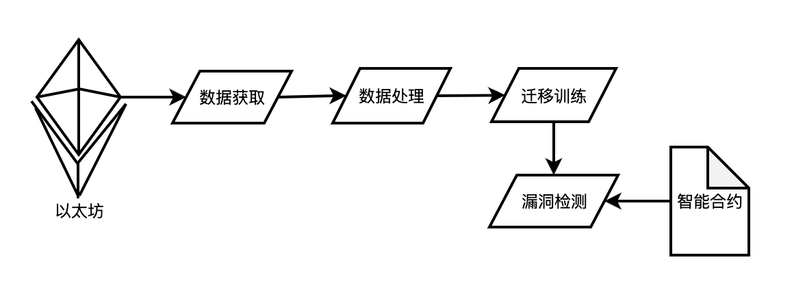

# Security-Analysis-of-Smart-Contracts
## 对一篇论文的小规模复现 [论文地址](https://www.ndss-symposium.org/ndss-paper/smarter-contracts-detecting-vulnerabilities-in-smart-contracts-with-deep-transfer-learning/ "悬停显示")
### 技术报告——基于深度迁移学习的智能合约漏洞检测
### 团队成员（上海奇安信总部——盘古实验室）
- **唐祝寿** - 项目总负责人
- **陆亦恬** - 数据分析师
- **朱璋颖** - 数据分析师
- **余俊** - 数据采集工程师

#### 一、说明 
随着区块链技术的快速发展，智能合约作为去中心化应用的重要组成部分，越来越受到关注。然而，智能合约的安全性问题也日益突出，其漏洞可能导致巨大的经济损失。本技术报告提出一种基于深度迁移学习的方法，旨在有效且高效地检测以太坊智能合约中的多种漏洞。  

本技术方法使用一个通用的特征提取器来学习智能合约的通用字节码语义，并分别学习每个漏洞类型的特征来训练可迁移学习的多标签分类器，使其可同时检测出智能合约的多个漏洞。与以往的检测方法相比，本方法可以通过迁移学习轻松扩展到数据有限的新漏洞类型。当新的漏洞类型出现时，本方法向训练好的特征提取器添加一个新的分支，并用有限的数据对其进行训练，由此将模型修改和重新训练开销降至最低。与现有的非机器学习工具相比，本方法可以应用于任意复杂度的智能合约，并确保100%的智能合约覆盖率。此外，本技术方法使用单个统一的技术框架实现了对多种漏洞类型的并发检测，大幅度缩短检测时间。  

本技术报告针对现有检测方法的不足，提出了一种基于深度迁移学习的检测方法，该方法能通过有限数据进行迁移学习新的漏洞类型。与现有的智能合约漏洞检测工具相比，本技术方法具有以下优势： 
- 操作比源代码更易访问的字节码
- 通过有效的迁移学习，用有限的数据检测新的漏洞类型
- 能够在一次扫描中快速并发检测多个漏洞类型

#### 二、实验
本方法的技术框架如图1所示。通过谷歌的bigquery查询到以太坊的公开数据集，获取智能合约的字节码数据，对字节码数据进行数据处理，将处理后的数据使用深度迁移学习技术训练模型，最后使用训练完的模型检测智能合约的漏洞类型。 

  

  图1

  
本方法的技术核心在于数据处理和深度学习架构，主要包括以下几个部分：
- **数据处理**   
-考虑到智能合约可能为空或自毁的情况，本方法过滤掉获取的空字节码0x。字节码由十六进制数字组成，表示特定的操作序列和参数，考虑到之后模型训练的性能问题，本方法将字节码长度限制在17.5k以内。本技术首先将收集的原始字节码转换为由唯一分隔符划分的操作序列，并从字节码中删除输入参数以减小输入大小。此外，将具有相同功能的操作合并为一个通用操作——命令PUSH1-PUSH32（由字节0x60-0x7f表示）被PUSH操作（由0x60表示）取代。如果已获取的字节码中的一些十六进制数字与以太坊黄皮书中定义的任何操作都不对应，则这些字节被视为无效操作，并用值XX代替。此操作合并步骤可能会将字节码映射到相同的预处理字节码。本方法还对经过数据预处理后的字节码数据集进行了重复数据消除，最后剩余15893个字节码。由于操作码足以捕获语义，因此本方法只对操作码进行建模，而忽略操作数。

数据集数量：15893  
训练集数量：12714  测试集数量：3179  
每个漏洞类型的数量：  
ARTHM:9492  
CDAV:32  
DOS:1189  
LE:1654  
RENT:4970   
TimeM:2103  
TimeO:1284  
UE:1520  
safe:5000  

#### 数据集处理  
根据论文里的做法，通过将字节码转换为操作码构建vocabulary，进而转化成向量
#### 模型构建    
根据论文里的做法，构建MOL_DNN模型（基于深度神经网络(Deep Neural Network, DNN)的Multi-Output Learning (MOL)模型，一种可以同时预测多个输出目标的机器学习模型），但由于最后的实际训练效果，最后一层只输出两个标签，正例和重定向漏洞标签。
#### 模型训练  
| Layer (type) | Output Shape | Param # |  
| :----: | :----: | :----: |  
| input_1 (InputLayer) | [(None,3930)] | 0 |  
| embedding (Embedding) | (None, 3930, 60) | 4620 |  
| gru (GRU) | (None, 32) | 9024 |  
| batch_normalization (BatchNormalization) | (None, 32) | 128 |  
| dropout (Dropout) | (None, 32) | 0 |  
| dense (Dense) | (None, 16) | 528 |  
| dense_2 (Dense)  | (None, 16) | 528 |  
| dense_4 (Dense)  | (None, 16) | 528 |  
| dense_6 (Dense)  | (None, 16) | 528 |  
| dense_8 (Dense)  | (None, 16) | 528 |  
| dense_10 (Dense)  | (None, 16) | 528 |  
| dense_12 (Dense)  | (None, 16) | 528 |  
| dense_14 (Dense)  | (None, 16) | 528 |  
| dense_16 (Dense)  | (None, 16) | 528 |  
| batch_normalization_1 (BatchNormalization) | (None, 16) | 64 |  
| batch_normalization_2 (BatchNormalization) | (None, 16) | 64 |  
| batch_normalization_3 (BatchNormalization) | (None, 16) | 64 |  
| batch_normalization_4 (BatchNormalization) | (None, 16) | 64 |  
| batch_normalization_5 (BatchNormalization) | (None, 16) | 64 |  
| batch_normalization_6 (BatchNormalization) | (None, 16) | 64 |  
| batch_normalization_7 (BatchNormalization) | (None, 16) | 64 |  
| batch_normalization_8 (BatchNormalization) | (None, 16) | 64 |  
| batch_normalization_9 (BatchNormalization) | (None, 16) | 64 |  
| dropout_1 (Dropout) | (None, 16) | 0 |  
| dropout_2 (Dropout) | (None, 16) | 0 |  
| dropout_3 (Dropout) | (None, 16) | 0 |  
| dropout_4 (Dropout) | (None, 16) | 0 |  
| dropout_5 (Dropout) | (None, 16) | 0 |  
| dropout_6 (Dropout) | (None, 16) | 0 |  
| dropout_7 (Dropout) | (None, 16) | 0 |  
| dropout_8 (Dropout) | (None, 16) | 0 |  
| dropout_9 (Dropout) | (None, 16) | 0 |  
| dense_1 (Dense) | (None, 1) | 17 |  
| dense_3 (Dense) | (None, 1) | 17 |  
| dense_5 (Dense) | (None, 1) | 17 |  
| dense_7 (Dense) | (None, 1) | 17 |  
| dense_9 (Dense) | (None, 1) | 17 |  
| dense_11 (Dense) | (None, 1) | 17 |  
| dense_13 (Dense) | (None, 1) | 17 |  
| dense_15 (Dense) | (None, 1) | 17 |  
| dense_17 (Dense) | (None, 1) | 17 |  

模型准确率：91.98%  
模型误报率：2.3%  
ARTHM accuracy: 0.3976  
CDAV accuracy: 0.9984  
DOS accuracy: 0.9201  
LE accuracy: 0.9025
RENT accuracy: 0.6861  
TimeM accuracy: 0.8610  
TimeO accuracy: 0.9236  
UE accuracy: 0.8912  
safe accuracy: 0.3108  

#### 模型检测（我和余到时候把分析结果写在这里）
检测结果：在线文档 https://kdocs.cn/l/cbrfAIlpfG0f  
检测数量：4/sec

